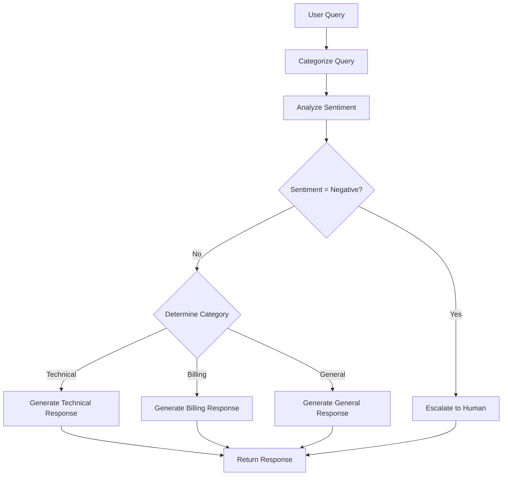

# 🤖 AI-Powered Customer Support Agent

**Production-Ready Deployment with FastAPI, LangGraph, and RAG**

[](https://www.python.org/downloads/)
[](https://fastapi.tiangolo.com/)
[](https://langchain-ai.github.io/langgraph/)
[](https://opensource.org/licenses/MIT)

An intelligent customer support system that automatically categorizes queries, analyzes sentiment, and generates contextual responses using Retrieval-Augmented Generation (RAG) with LangGraph workflow orchestration.


---

## 📋 Table of Contents

- [Features](#-features)
- [Architecture](#-architecture)
- [Prerequisites](#-prerequisites)
- [Quick Start](#-quick-start)
- [Project Structure](#-project-structure)
- [Configuration](#-configuration)
- [Deployment](#-deployment)
  - [Local Development](#local-development)
  - [Docker Deployment](#docker-deployment)
  - [AWS EC2 Deployment](#aws-ec2-deployment)
  - [AWS Lambda (Serverless)](#aws-lambda-serverless)
- [API Documentation](#-api-documentation)
- [Testing](#-testing)
- [Monitoring](#-monitoring)
- [Cost Analysis](#-cost-analysis)
- [Troubleshooting](#-troubleshooting)
- [Contributing](#-contributing)
- [License](#-license)

---

## ✨ Features

### Core Capabilities
- **🎯 Intelligent Query Categorization**: Automatically classifies queries into Technical, Billing, or General
- **😊 Sentiment Analysis**: Detects Positive, Neutral, or Negative sentiment for prioritization
- **🤖 RAG-Powered Responses**: Retrieves relevant knowledge base content and generates contextual answers
- **🚨 Smart Escalation**: Automatically escalates negative sentiment queries to human agents
- **💬 Real-time Chat Interface**: Beautiful, responsive web UI with session persistence
- **⚡ High Performance**: Sub-3-second response times with async processing
- **🔒 Production-Ready**: NGINX reverse proxy, SSL support, health checks, structured logging

### Technical Highlights
- **LangGraph Workflow**: Stateful agent orchestration with conditional routing
- **ChromaDB Vector Store**: Efficient similarity search with metadata filtering
- **OpenAI GPT-4o**: State-of-the-art language understanding and generation
- **FastAPI Backend**: Modern async Python framework with automatic API docs
- **Uvicorn ASGI Server**: High-performance async server
- **Docker Containerization**: Easy deployment and scaling
- **NGINX Load Balancing**: Production-grade reverse proxy

---

## 🏗️ Architecture

```
┌─────────────────────────────────────────────┐
│            User Browser                     │
└──────────────────┬──────────────────────────┘
                   │ HTTPS
                   ▼
┌─────────────────────────────────────────────┐
│         NGINX (Port 80/443)                 │
│  • SSL Termination                          │
│  • Load Balancing                           │
│  • Static File Serving                      │
└──────────────────┬──────────────────────────┘
                   │ HTTP (localhost:8000)
                   ▼
┌─────────────────────────────────────────────┐
│    FastAPI + Uvicorn (Port 8000)           │
│  • REST API Endpoints                       │
│  • WebSocket for Real-time Chat            │
│  • Session Management                       │
└──────────────────┬──────────────────────────┘
                   │
                   ▼
┌─────────────────────────────────────────────┐
│      LangGraph Agent Workflow               │
│  1. Categorize Query                        │
│  2. Analyze Sentiment                       │
│  3. Route to Handler                        │
│  4. Generate Response (RAG)                 │
└──────────────────┬──────────────────────────┘
                   │
                   ▼
┌─────────────────────────────────────────────┐
│         ChromaDB (Vector Store)             │
│  • Knowledge Base Embeddings                │
│  • Metadata Filtering                       │
│  • Similarity Search                        │
└─────────────────────────────────────────────┘
```

### Workflow Diagram



---

## 🔧 Prerequisites

### Required Software
- **Python**: 3.11 or higher ([Download](https://www.python.org/downloads/))
- **Git**: For version control ([Download](https://git-scm.com/downloads))
- **OpenAI API Key**: [Get your key](https://platform.openai.com/api-keys)

### Optional (for deployment)
- **Docker**: For containerization ([Install](https://docs.docker.com/get-docker/))
- **AWS Account**: For EC2 deployment
- **Domain Name**: For production deployment with SSL

### System Requirements
- **CPU**: 2+ cores
- **RAM**: 4GB minimum, 8GB recommended
- **Disk**: 10GB free space
- **Network**: Internet connection for API calls

---

## 🚀 Quick Start

### 1. Clone the Repository
```bash
git clone https://github.com/your-username/customer-support-agent.git
cd customer-support-agent
```

### 2. Set Up Python Environment
```bash
# Create virtual environment
python -m venv venv

# Activate (Windows)
venv\Scripts\activate

# Activate (Mac/Linux)
source venv/bin/activate
```

### 3. Install Dependencies
```bash
cd backend
pip install --upgrade pip
pip install -r requirements.txt
```

### 4. Configure Environment Variables
```bash
# Create .env file
cp .env.example .env

# Edit .env and add your OpenAI API key
# Windows
notepad .env

# Mac/Linux
nano .env
```

Add the following to `.env`:
```env
OPENAI_API_KEY=sk-your-actual-api-key-here
```

### 5. Initialize Knowledge Base
```bash
# This will load documents and create ChromaDB embeddings
python -c "from app.database.vectordb import initialize_vectordb; initialize_vectordb()"
```

### 6. Run the Server
```bash
# Development mode (with auto-reload)
uvicorn app.main:app --reload --host 0.0.0.0 --port 8000
```

### 7. Access the Application
- **Frontend**: http://localhost:8000
- **API Docs**: http://localhost:8000/docs
- **Health Check**: http://localhost:8000/health

### 8. Test the Chat
Open your browser and navigate to `http://localhost:8000`. Try these sample queries:
- "What payment methods do you support?" (Billing query)
- "Do you support on-premises models?" (Technical query)
- "What is your refund policy?" (General query)
- "I'm very frustrated with this product!" (Negative sentiment → escalation)

---

## 📁 Project Structure

```
customer-support-agent/
│
├── backend/                          # Backend application
│   ├── app/
│   │   ├── __init__.py
│   │   ├── main.py                   # FastAPI app entry point
│   │   ├── agents/                   # AI agent modules
│   │   │   ├── __init__.py
│   │   │   ├── classifier.py         # Query categorizer
│   │   │   ├── sentiment.py          # Sentiment analyzer
│   │   │   ├── handlers.py           # Response generators
│   │   │   └── escalation.py         # Human escalation logic
│   │   ├── workflows/                # LangGraph workflows
│   │   │   ├── __init__.py
│   │   │   └── support_graph.py      # Main workflow graph
│   │   ├── models/                   # Data models
│   │   │   ├── __init__.py
│   │   │   └── schemas.py            # Pydantic schemas
│   │   ├── database/                 # Database modules
│   │   │   ├── __init__.py
│   │   │   └── vectordb.py           # ChromaDB setup
│   │   └── config/                   # Configuration
│   │       ├── __init__.py
│   │       └── settings.py           # Environment settings
│   ├── data/
│   │   └── router_agent_documents.json  # Knowledge base
│   ├── knowledge_base/               # ChromaDB persistence (auto-generated)
│   ├── requirements.txt              # Python dependencies
│   ├── .env                          # Environment variables (create this)
│   └── .env.example                  # Environment template
│
├── frontend/                         # Frontend application
│   ├── index.html                    # Main chat UI
│   ├── static/
│   │   ├── css/
│   │   │   └── style.css             # Styling
│   │   ├── js/
│   │   │   └── chat.js               # Chat logic
│   │   └── assets/
│   │       ├── logo.png              # Brand assets
│   │       └── favicon.ico
│   └── nginx.conf                    # NGINX configuration
│
├── deployment/                       # Deployment configurations
│   ├── docker/
│   │   ├── Dockerfile                # Docker image definition
│   │   └── docker-compose.yml        # Multi-container setup
│   ├── ec2/
│   │   ├── setup.sh                  # EC2 provisioning script
│   │   ├── systemd/
│   │   │   └── support-agent.service # Systemd service file
│   │   └── nginx/
│   │       └── sites-available/
│   │           └── support-agent     # NGINX site config
│   └── lambda/
│       ├── lambda_handler.py         # AWS Lambda handler
│       └── requirements.txt          # Lambda dependencies
│
├── tests/                            # Test suite
│   ├── __init__.py
│   ├── test_agents.py                # Agent unit tests
│   ├── test_api.py                   # API integration tests
│   └── test_workflows.py             # Workflow tests
│
├── docs/                             # Documentation
│   ├── API.md                        # API documentation
│   ├── DEPLOYMENT.md                 # Deployment guide
│   └── ARCHITECTURE.md               # Architecture details
│
├── .gitignore                        # Git ignore rules
├── .dockerignore                     # Docker ignore rules
├── README.md                         # This file
├── PRD.md                            # Product Requirements Document
└── LICENSE                           # MIT License
```

---

## ⚙️ Configuration

### Environment Variables

Create a `.env` file in the `backend/` directory:

```env
# OpenAI Configuration (Required)
OPENAI_API_KEY=sk-your-api-key-here

# API Configuration
API_HOST=0.0.0.0
API_PORT=8000
API_WORKERS=4

# LLM Configuration
LLM_MODEL=gpt-4o
LLM_TEMPERATURE=0.0
EMBEDDING_MODEL=text-embedding-3-small

# ChromaDB Configuration
CHROMADB_PATH=./knowledge_base
CHROMADB_COLLECTION=knowledge_base

# RAG Configuration
RAG_TOP_K=3
RAG_SCORE_THRESHOLD=0.2

# Application Settings
MAX_QUERY_LENGTH=500
RATE_LIMIT_PER_MINUTE=10
SESSION_TIMEOUT_HOURS=24

# Logging
LOG_LEVEL=INFO
LOG_FILE=agent.log

# Security
ALLOWED_ORIGINS=http://localhost:8000,http://localhost:3000
```

### Customizing the Knowledge Base

Edit `backend/data/router_agent_documents.json`:

```json
{
  "documents": [
    {
      "text": "Your knowledge base content here...",
      "metadata": {
        "category": "technical",
        "source": "FAQ",
        "last_updated": "2025-01-15"
      }
    }
  ]
}
```

After updating, reinitialize the vector database:
```bash
python -c "from app.database.vectordb import initialize_vectordb; initialize_vectordb()"
```

---

## 🚢 Deployment

### Local Development

```bash
# Start development server with auto-reload
cd backend
uvicorn app.main:app --reload --host 0.0.0.0 --port 8000
```

### Docker Deployment

#### Build and Run
```bash
# Build Docker image
docker build -t customer-support-agent:latest -f deployment/docker/Dockerfile .

# Run container
docker run -d \
  --name support-agent \
  -p 8000:8000 \
  -e OPENAI_API_KEY=sk-your-key \
  -v $(pwd)/backend/knowledge_base:/app/backend/knowledge_base \
  customer-support-agent:latest
```

#### Using Docker Compose
```bash
cd deployment/docker

# Create .env file with your API key
echo "OPENAI_API_KEY=sk-your-key" > .env

# Start all services (backend + nginx)
docker-compose up -d

# View logs
docker-compose logs -f

# Stop services
docker-compose down
```

Access the application at: http://localhost

### AWS EC2 Deployment

#### Step 1: Launch EC2 Instance
1. **Instance Type**: t3.medium (2 vCPU, 4GB RAM)
2. **AMI**: Ubuntu 22.04 LTS
3. **Storage**: 20GB gp3
4. **Security Group**:
   - Port 22 (SSH) - Your IP only
   - Port 80 (HTTP) - 0.0.0.0/0
   - Port 443 (HTTPS) - 0.0.0.0/0

#### Step 2: Connect to Instance
```bash
ssh -i your-key.pem ubuntu@your-ec2-public-ip
```

#### Step 3: Run Setup Script
```bash
# Clone repository
git clone https://github.com/your-username/customer-support-agent.git
cd customer-support-agent/deployment/ec2

# Make setup script executable
chmod +x setup.sh

# Run setup (this will take 5-10 minutes)
sudo ./setup.sh

# Edit .env file with your API key
sudo nano /home/ubuntu/customer-support-agent/backend/.env
# Add: OPENAI_API_KEY=sk-your-key

# Restart service
sudo systemctl restart support-agent
```

#### Step 4: Verify Deployment
```bash
# Check service status
sudo systemctl status support-agent

# Check nginx status
sudo systemctl status nginx

# View logs
sudo journalctl -u support-agent -f
```

Access your application at: `http://your-ec2-public-ip`

#### Step 5: Configure SSL (Optional but Recommended)
```bash
# Install Certbot
sudo apt install certbot python3-certbot-nginx

# Get SSL certificate (replace with your domain)
sudo certbot --nginx -d your-domain.com

# Auto-renewal is enabled by default
# Test renewal: sudo certbot renew --dry-run
```

### AWS Lambda (Serverless)

#### Step 1: Package Dependencies
```bash
cd deployment/lambda

# Create deployment package
pip install -r requirements.txt -t package/
cd package
zip -r ../lambda-deployment.zip .
cd ..

# Add application code
zip -g lambda-deployment.zip lambda_handler.py
zip -gr lambda-deployment.zip ../../backend/app
```

#### Step 2: Create Lambda Function
1. Go to AWS Lambda Console
2. Create Function → Author from scratch
3. Runtime: Python 3.11
4. Timeout: 30 seconds
5. Memory: 1024 MB
6. Upload `lambda-deployment.zip`

#### Step 3: Configure Environment Variables
Add in Lambda Configuration → Environment variables:
```
OPENAI_API_KEY=sk-your-key
```

#### Step 4: Create API Gateway
1. Create REST API
2. Add Lambda integration
3. Deploy to stage (e.g., "prod")

Access your API at: `https://your-api-id.execute-api.region.amazonaws.com/prod/`

**Note**: For production Lambda deployment, use S3 for ChromaDB persistence.

---

## 📚 API Documentation

### REST Endpoints

#### POST `/api/chat`
Submit a customer support query.

**Request:**
```json
{
  "query": "What payment methods do you support?",
  "session_id": "optional-session-id"
}
```

**Response:**
```json
{
  "response": "We support credit cards (Visa, MasterCard, Amex), PayPal, and bank transfers...",
  "category": "Billing",
  "sentiment": "Neutral",
  "session_id": "550e8400-e29b-41d4-a716-446655440000"
}
```

#### GET `/health`
Health check endpoint.

**Response:**
```json
{
  "status": "healthy",
  "vectordb": "connected",
  "timestamp": "2025-10-15T12:00:00Z"
}
```

#### WebSocket `/ws/chat`
Real-time streaming chat.

**Connect:**
```javascript
const ws = new WebSocket('ws://localhost:8000/ws/chat');

ws.onopen = () => {
  ws.send('What is your refund policy?');
};

ws.onmessage = (event) => {
  const data = JSON.parse(event.data);
  console.log(data.response);
};
```

### Interactive API Docs
- **Swagger UI**: http://localhost:8000/docs
- **ReDoc**: http://localhost:8000/redoc

---

## 🧪 Testing

### Unit Tests
```bash
cd backend
pytest tests/test_agents.py -v
```

### Integration Tests
```bash
pytest tests/test_api.py -v
```

### End-to-End Tests
```bash
pytest tests/ -v --cov=app
```

### Manual Testing
Use the provided test script:
```bash
python tests/manual_test.py
```

Sample test queries:
```python
# Billing query
curl -X POST http://localhost:8000/api/chat \
  -H "Content-Type: application/json" \
  -d '{"query": "What payment methods do you support?"}'

# Technical query
curl -X POST http://localhost:8000/api/chat \
  -H "Content-Type: application/json" \
  -d '{"query": "Do you support on-premises deployment?"}'

# Negative sentiment (should escalate)
curl -X POST http://localhost:8000/api/chat \
  -H "Content-Type: application/json" \
  -d '{"query": "I am extremely frustrated with your service!"}'
```

---

## 📊 Monitoring

### Health Checks
```bash
# Check if service is running
curl http://localhost:8000/health

# Expected output:
# {"status": "healthy", "vectordb": "connected"}
```

### Logs
```bash
# View application logs
tail -f backend/agent.log

# View systemd logs (EC2)
sudo journalctl -u support-agent -f

# Docker logs
docker logs -f support-agent
```

### Metrics to Monitor
- **Response Time**: P50, P95, P99 latencies
- **Error Rate**: Failed requests / Total requests
- **Category Distribution**: Technical, Billing, General counts
- **Sentiment Distribution**: Positive, Neutral, Negative counts
- **Escalation Rate**: Negative sentiment queries / Total queries

### Log Format
```json
{
  "timestamp": "2025-10-15T12:34:56Z",
  "level": "INFO",
  "session_id": "550e8400-e29b-41d4-a716-446655440000",
  "query": "What is your refund policy?",
  "category": "General",
  "sentiment": "Neutral",
  "response_time_ms": 2345,
  "status": "success"
}
```

---

## 💰 Cost Analysis

### EC2 Deployment (24/7 Uptime)
| Component | Cost/Month |
|-----------|------------|
| EC2 t3.medium | $30 |
| EBS Storage (20GB) | $2 |
| Data Transfer (50GB) | $5 |
| OpenAI API (1000 queries/day) | $15 |
| **Total** | **~$52/month** |

### Lambda Deployment (Serverless)
| Component | Cost (Low Traffic) | Cost (High Traffic) |
|-----------|-------------------|---------------------|
| Lambda Invocations | $0.20 | $15 |
| API Gateway | $3.50 | $20 |
| OpenAI API | $5 | $30 |
| S3 Storage | $0.10 | $0.50 |
| **Total** | **~$9/month** | **~$65/month** |

### Cost Optimization Tips
1. **Use GPT-4o-mini** for classification (10x cheaper than GPT-4o)
2. **Cache frequent queries** with Redis (reduce LLM calls)
3. **Use Reserved Instances** for EC2 (30-40% savings)
4. **Set OpenAI spending limits** to avoid surprises
5. **Monitor usage** with CloudWatch dashboards

---

## 🔧 Troubleshooting

### Common Issues

#### 1. "Module not found" Error
```bash
# Solution: Ensure virtual environment is activated
source venv/bin/activate  # Mac/Linux
venv\Scripts\activate     # Windows

# Reinstall dependencies
pip install -r requirements.txt
```

#### 2. "OpenAI API Key Invalid"
```bash
# Solution: Verify .env file
cat backend/.env  # Should show: OPENAI_API_KEY=sk-...

# Test API key
curl https://api.openai.com/v1/models \
  -H "Authorization: Bearer YOUR_API_KEY"
```

#### 3. ChromaDB Initialization Fails
```bash
# Solution: Delete and reinitialize
rm -rf backend/knowledge_base
python -c "from app.database.vectordb import initialize_vectordb; initialize_vectordb()"
```

#### 4. NGINX 502 Bad Gateway
```bash
# Solution: Check if FastAPI is running
curl http://localhost:8000/health

# If not, restart service
sudo systemctl restart support-agent

# Check NGINX config
sudo nginx -t
```

#### 5. High Latency (>5 seconds)
- **Check OpenAI API status**: https://status.openai.com
- **Optimize prompts**: Reduce token usage
- **Use faster model**: gpt-4o-mini instead of gpt-4o
- **Add caching**: Cache frequent queries

#### 6. Port 8000 Already in Use
```bash
# Find and kill process
# Windows
netstat -ano | findstr :8000
taskkill /PID <PID> /F

# Mac/Linux
lsof -ti:8000 | xargs kill -9
```

### Getting Help
- **Issues**: [GitHub Issues](https://github.com/your-username/customer-support-agent/issues)
- **Discussions**: [GitHub Discussions](https://github.com/your-username/customer-support-agent/discussions)
- **Email**: prashant9501@gmail.com

---

## 🤝 Contributing

We welcome contributions! Please follow these steps:

1. **Fork the repository**
2. **Create a feature branch**
   ```bash
   git checkout -b feature/amazing-feature
   ```
3. **Make your changes**
4. **Add tests** for new functionality
5. **Commit with clear messages**
   ```bash
   git commit -m "Add amazing feature"
   ```
6. **Push to your fork**
   ```bash
   git push origin feature/amazing-feature
   ```
7. **Open a Pull Request**

### Code Standards
- Follow PEP 8 style guide
- Add type hints to all functions
- Write docstrings for modules, classes, and functions
- Maintain >80% test coverage
- Update documentation for new features

---

## 📄 License

This project is licensed under the MIT License - see the [LICENSE](LICENSE) file for details.

```
MIT License

Copyright (c) 2025 K21 Academy

Permission is hereby granted, free of charge, to any person obtaining a copy
of this software and associated documentation files (the "Software"), to deal
in the Software without restriction, including without limitation the rights
to use, copy, modify, merge, publish, distribute, sublicense, and/or sell
copies of the Software, and to permit persons to whom the Software is
furnished to do so, subject to the following conditions:

The above copyright notice and this permission notice shall be included in all
copies or substantial portions of the Software.

THE SOFTWARE IS PROVIDED "AS IS", WITHOUT WARRANTY OF ANY KIND, EXPRESS OR
IMPLIED, INCLUDING BUT NOT LIMITED TO THE WARRANTIES OF MERCHANTABILITY,
FITNESS FOR A PARTICULAR PURPOSE AND NONINFRINGEMENT. IN NO EVENT SHALL THE
AUTHORS OR COPYRIGHT HOLDERS BE LIABLE FOR ANY CLAIM, DAMAGES OR OTHER
LIABILITY, WHETHER IN AN ACTION OF CONTRACT, TORT OR OTHERWISE, ARISING FROM,
OUT OF OR IN CONNECTION WITH THE SOFTWARE OR THE USE OR OTHER DEALINGS IN THE
SOFTWARE.
```

---

## 🙏 Acknowledgments

- **LangChain Team**: For the amazing LangGraph framework
- **FastAPI**: For the modern Python web framework
- **OpenAI**: For powerful language models
- **ChromaDB**: For efficient vector storage
- **K21 Academy**: For training and support

---

## 📞 Contact

- **Website**: https://www.linkedin.com/in/prashantksahu
- **Email**: prashant9501@gmail.com
- **GitHub**: https://github.com/prashant9501/customer-support-agent

---

## 🗺️ Roadmap

### ✅ Phase 1: MVP (Completed)
- [x] Core agent workflow with LangGraph
- [x] FastAPI backend with REST API
- [x] Responsive chat UI
- [x] ChromaDB vector store
- [x] Docker containerization
- [x] EC2 deployment scripts

### 🚧 Phase 2: Enhancements (In Progress)
- [ ] WebSocket streaming responses
- [ ] Session history persistence
- [ ] Response feedback mechanism
- [ ] Admin dashboard
- [ ] Kubernetes deployment
- [ ] CI/CD pipeline

### 📅 Phase 3: Advanced Features (Planned)
- [ ] Multi-language support
- [ ] Voice input/output
- [ ] Advanced analytics
- [ ] Custom model fine-tuning
- [ ] Multi-channel support (Slack, WhatsApp)
- [ ] CRM integrations

---

## 📸 Screenshots

### Chat Interface


### API Documentation


### Monitoring Dashboard


---

**Made with ❤️ by Prashant Sahu**

**Star ⭐ this repo if you find it useful!**

---

**Last Updated**: October 15, 2025  
**Version**: 1.0.0  
**Status**: Production Ready 🚀
